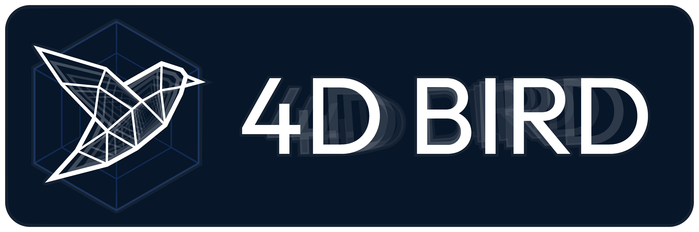

<!--

**Hey there!** Welcome to **4D Bird** - I'm glad you found this page!
-->

 
<!-- Crazy hack to get around GitHub's strict markdown limitations. Credit: https://stackoverflow.com/a/78845294 -->

  <ul align="center" style="list-style: none;">
    

      <h2>Hey there!</h2>
    

  </ul>

Welcome to **4D Bird** - 

I'm glad you found this page!

 

## 👤 Who I am

Let me describe myself a bit:

Being *a very curious person*, I am interested in science and technology, especially astronautics, and computer science.

An **independent programmer**, I use GitHub for both public as well as private projects. Not only to back my code up and synchronize it across devices, but also to document my (public) work, allow others to learn from it, and let people verify its safety.

Expect, for the most part, **various technical projects**, like science-based games, simulations, or tools to appear on this profile.

## ⚙️ What I Can Do

My most *specific* skills undoubtedly lie in <ins>**C#/.NET**</ins> and **Unity Engine**, with additional experience in **Java**, **Python**, and **JavaScript**.

More than any single language or framework, though, I excel at *general problem solving* - I adapt to new tools and environments quickly, and more broadly, I solve challenges using out-of-the-box thinking, and am not afraid of using non-standard solutions!

One of my biggest strengths is the ability to see and think about large, complex systems as a whole, allowing me to see connections between apparently unrelated components. In other words: Abstract thinking and pattern recognition.

## 🎵 Beyond Hard Science

Beyond science and programming, I also often immerse myself in plenty of other activities I find to be mentally stimulating:
* I have an interest in languages, natural and constructed alike. I speak:
  * **German** (native)
  * **English** (essentially native)
  * **Russian** (conversational)
  * **Polish** (conversational-ish).
* I enjoy playing **Chess**. As of the time of writing, at ~1600 Elo level.
* I have a modest understanding of music theory - questionable piano skills included. I also like microtonal music.

And various other minor side-hobbies, of which there are too many to mention.

## 📬 Contact

<ins>If you are interested in hiring me, **I'm open to receiving offers**.</ins> I generally prefer one-time projects or a freelancing/B2B-style model, though I am open to traditional employment if the offer is appealing. In either case, contact me if you are interested.

*(**Note:** My profile might appear more empty than it actually is. Multiple projects are private for one reason or another, so if you need further reassurance of my abilities, I can show you around in a video call.)*

For any other matters, such as legal questions or collaboration requests, or if you simply recognize a bit of yourself in this page and are interested in me as a person, feel free to contact me. Just state your request clearly.

*Please do not contact me for gameplay help, bug reports, or random trivial programming help questions. There are better places for those.*
